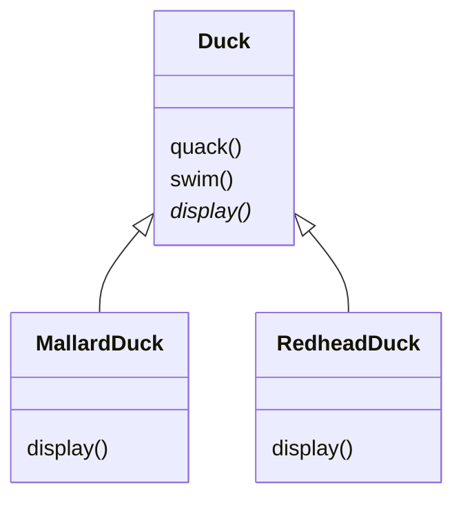
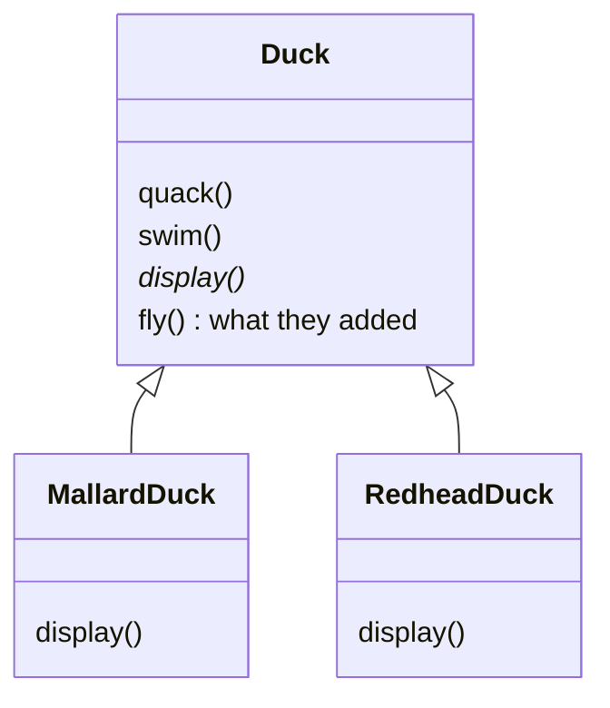
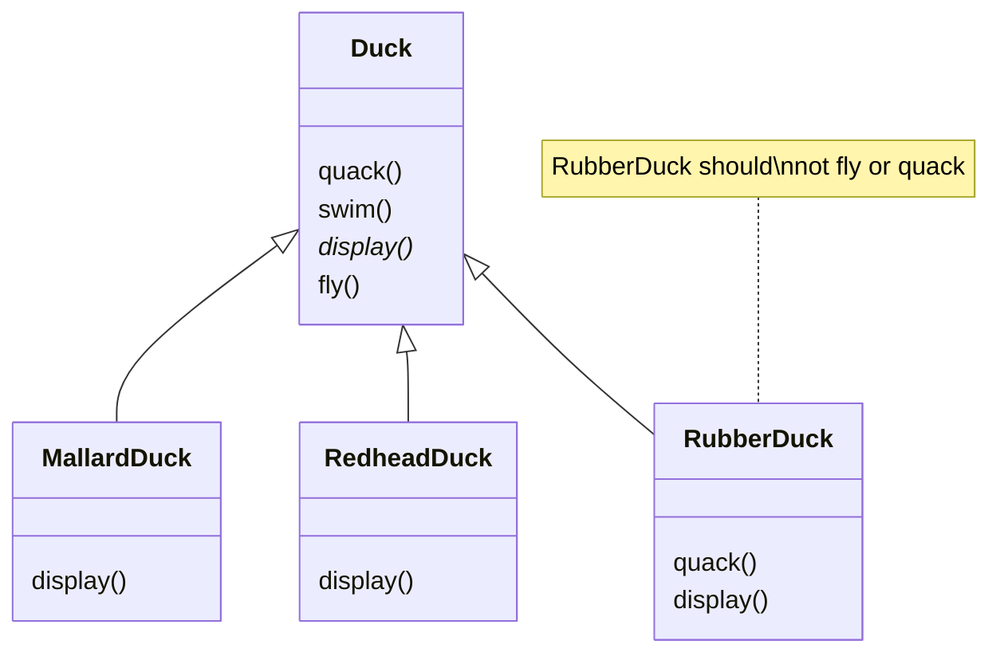
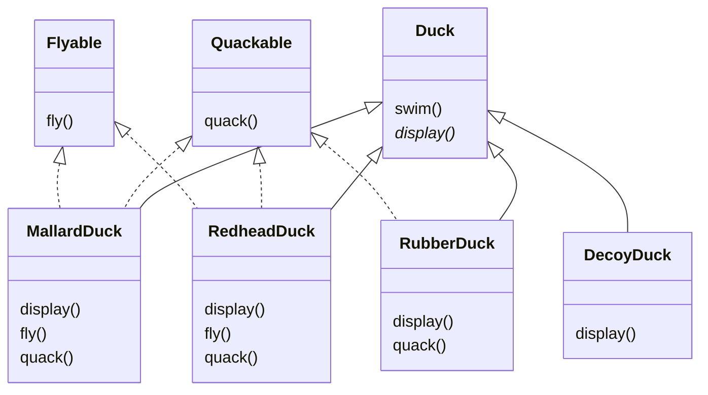
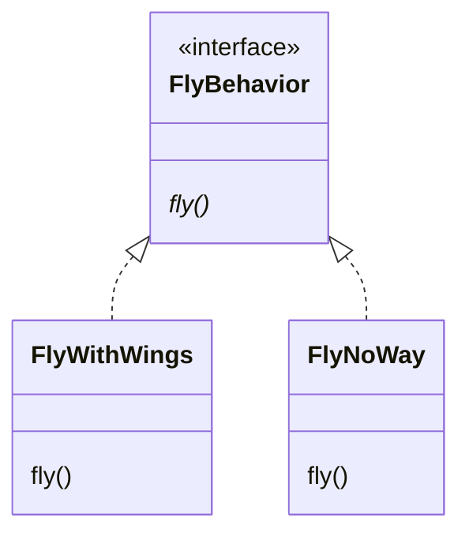
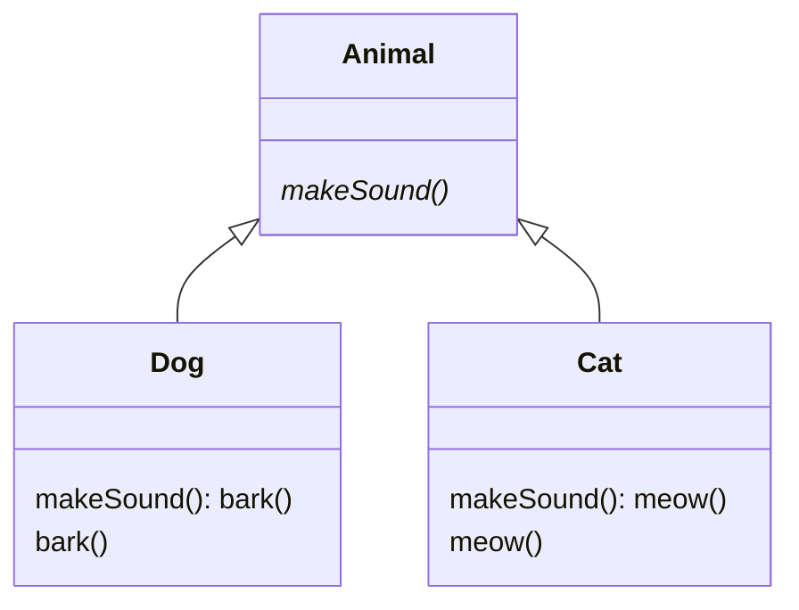
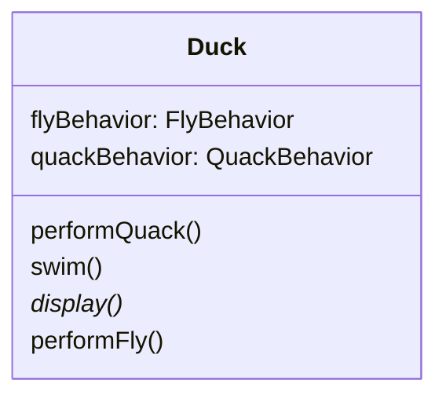
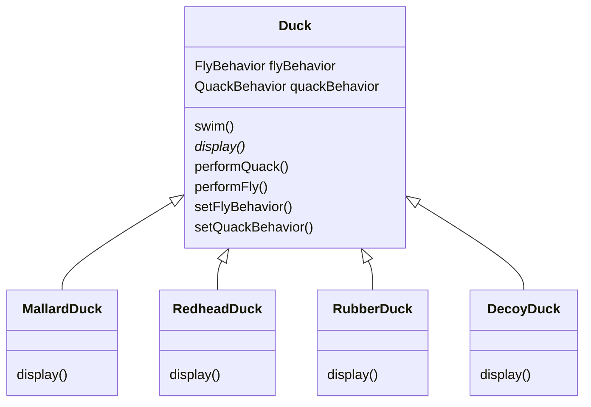
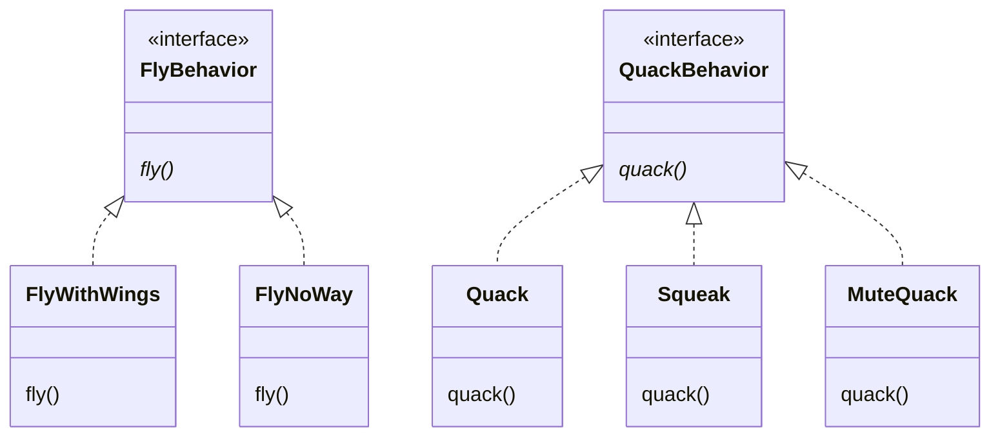
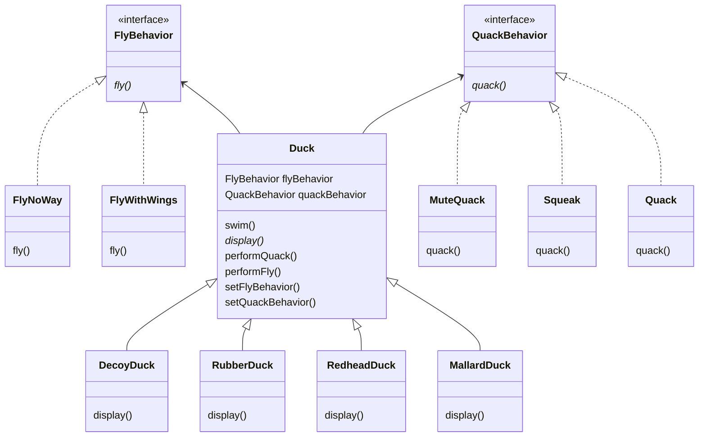

# 3.1 Overview of SimUDuck

&nbsp;&nbsp; SimUDuck is a highly successful duck pond simulation game. The game can show a large variety of duck species swimming and making quacking sounds. The initial designers used standard OO techniques and created one Duck superclass from which all other duck types inherit.



## a. We Need to Add Flying Ducks

&nbsp;&nbsp; The executives wanted to add a new feature to the simulator: flying ducks. So they just added a `fly()` method in the Duck class and then all the ducks inherited it. 



## b. Rubber Ducks Can't Fly

&nbsp;&nbsp; But they failed to notice that not *all* subclasses of Duck should *fly*. When they added a new behavior to the Duck superclass, they were also adding behavior that was *not* appropriate for some Duck subclasses.



&nbsp;&nbsp; The designers thought they could just override the `fly()` method in rubber duck to do nothing. But using inheritance to provide Duck behavior has disadvantages:

1. Code is duplicated across subclasses.
2. Runtime behavior changes are difficult.
3. It's hard to gain knowledge of all duck behaviors.
4. Changes can unintentionally affect other ducks.

<div class="bg"></div>

&nbsp;&nbsp; In other words, this method violates the SOLID principles, specifically the **SRP** (Single Responsibility Principle), **OCP** (Open/Closed Principle), **LSP** (Liskov Substitution Principle), and **ISP** (Interface Segregation Principle).

<div class="bg"></div>

> **SRP OCP LSP ISP**

## c. How about an Interface?

&nbsp;&nbsp; The designers decided to use interfaces to solve the problem. They created a `Flyable` interface and a `Quackable` interface. 



&nbsp;&nbsp; We know that not *all* of the subclasses should have flying or quacking behavior, so inheritance isn't the right answer. But while having the subclasses implement Flyable and Quackable solves *part* of the problem, it completely destroys code reuse for those behaviors, so it just creates a *different* maintenance problem. And of course there might be more than one kind of flying behavior.

> **SRP OCP ISP**

# 3.2 Strategy Pattern

&nbsp;&nbsp; The Java interfaces typically have no implementation code, so no code reuse. In either case, whenever you need to modify a behavior, you're often forced to track down and change it in all different sublcasses where that behavior is defined, probably introducing *new* bugs along the way.

> **Design Principle**
>
> Identify the aspects of your application that vary and separate them from what stays the same.

&nbsp;&nbsp; Here's another way to think about this principle: ***take ther parts that vary and encapsulate them, so that later you can alter or extend the parts that vary without affecting those that don't.***

## a. Separating What Changes from What Stays the Same

&nbsp;&nbsp; To seperate the "parts that change from those that stay the same", we're going to create two *sets* of classes (totally apart from Duck), one for *fly* and one for *quack*. Each set of classes will hold all the implementations of the respective behavior. For instance, we might have *one* class that implements *quacking*, *another* that implements *squeaking*, and *another* that implements *silence*.

## b. Designing the Duck Behaviors

> **Design Principle**
>
> Program to an interface, not an implementation.

&nbsp;&nbsp; We'll use an interface to represent each behavior—for instance, FlyBehavior and QuackBehavior—and each implementation of a *behavior* will implement one of those interfaces. 

&nbsp;&nbsp; So we'll make a set of classes whose entire reason for living is to represent a bahavior (for example, "squeaking"), and it's the *behavior* class, rather than the Duck class, that will implement the behavior interface.

&nbsp;&nbsp; With our new design,the Duck subclasses will use a behavior represented by and ***interface*** (FlyBehavior and QuackBehavior), so thatthe actual *implementation* of the behavior (in other words, the specific concrete behavior coded in the class that implements the FlyBehavior or QuackBehavior) won't be locked into the Duck subclass.



> **"Program to an interface" really means "Program to a supertype[^1]".**

&nbsp;&nbsp; It means taking advantage of polymorphism by programming to a supertype so that the actual runtime object[^2] isn't locked into the code. And we could rephrase "program to a supertype" as "the declared type of the variables should be a supertype, usually an abstract class or interface, so that the objects assigned to those variables can be of any concrete implementation of the supertype, which means the class declaring the variables doesn't have to know about the actual object types."

&nbsp;&nbsp; Here's a simple example of using polymorphism type—imagine an abstract class Animal, with two concrete implementations, Dog and Cat.



&nbsp;&nbsp; **Programming to an implementation** would be:

```java
Dog d = new Dog();
d.bark();

/* 
*  Declaring the variable "d" as type Dog forces
*  us to code to a concrete implementation.
*/
```

&nbsp;&nbsp; But **programming to an interface/supertype** would be:

```java
Animal animal = new Dog();
animal.makeSound();

/*
*  We know it's a Dog, but we can now use the
*  animal reference polymorphically.
*/
```

&nbsp;&nbsp; Even better, rather than hardcoding the instantiation of the subtype (like new Dog()) into the code, **assign the concrete implementation object at runtime**:

```java
a = getAnimal();
a.makeSound();

/*
*  We don't know WHAT the actual animal subytype
*  is... all we care about is that it knows how
*  to respond to makeSound().
*/
```

## c. Integrating the Duck Behaviors

&nbsp;&nbsp; Here's the key: A duck will now delegate its flying and quacking behaviors, instead of using quacking and flying methods defined in the Duck class.

&nbsp;&nbsp; 1. **First, we'll add two instance variables of type Flybehavior and QuackBehavior**—let's call them `flyBehavior` and `quackBehavior`. Each concrete duck object will assign to those variables a *specific* behavior at runtims, like `FlyWithWings` or `Squeak` for quacking.



&nbsp;&nbsp; 2. **Now we implement performQuack():**

<div class="bg"></div>

```java
public abstract class Duck {
    QuackBehavior quackBehavior;
    // more
    /* 
    *  Each Duck has a reference to something that
    *  implements the QuackBehavior interface.
    */

    public void performQuack() {
        quackBehavior.quack();
    }
    /*
    *  Rather than handling th quack behavior itself,
    *  the Duck object delegates that behavior to the
    *  object referenced by quackBehavior.
    */
}
```

&nbsp;&nbsp; To perform the quack, a Duck asks the object that is referenced by quackBehavior to quack for it. In this part of the code we don't care *what kind* of object the Duck is, ***all we care about is that it knows how to quack().***

&nbsp;&nbsp; 3. **How the flyBehavior and quackBehavior instance variables are set:**

```java
public class MallardDuck extends Duck {

    public MallardDuck() {
        quackBehavior = new Quack();
        flyBehavior = new FlyWithWings();
    }

    public void display() {
        System.out.println("I'm a real Mallard duck");
    }
}
```

&nbsp;&nbsp; When a MallardDuck is instantiated, its constructor initializes the MallardDuck's inherited quackBehavior instance variable to a new instance of type Quack (a QuackBehavior concrete implementation class).

&nbsp;&nbsp; And the same is true for the duck's flying behavior—the MallardDuck's constructor initializes the inherited flyBehavior instance variable with an instance of type FlyWithWings (a FlyBehavior concrete implementation class).

# 3.3 Testing the Duck Code

## a. Client



## b. Encapsulated Behaviors



## c. Duck Simulator



## d. Java Code

### i. `Duck.java`

```java
abstract public class Duck {
    FlyBehavior flyBehavior;
    QuackBehavior quackBehavior;
    public Duck() {}

    abstract public void display();

    public void swim() {
        System.out.println("All ducks float, even decoys!");
    }
    public void performQuack() {
        quackBehavior.quack();
    }
    public void performFly() {
        flyBehavior.fly();
    }
    public void setQuackBehavior(QuackBehavior qb) {
        quackBehavior = qb;
    }
    public void setFlyBehavior(FlyBehavior fb) {
        flyBehavior = fb;
    }
}
```

### ii. `MallardDuck.java`

```java
public class MallardDuck extends Duck {
    public MallardDuck() {
        quackBehavior = new Quack();
        flyBehavior = new FlyWithWings();
    }
    public void display() {
        System.out.println("I'm a real Mallard duck");
    }
}
```

### iii. `FlyBehavior.java`

```java
interface FlyBehavior {
    public void fly();
}
```

### iv. `FlyWithWings.java`

```java
public class FlyWithWings implements FlyBehavior {
    public void fly() {
        System.out.println("I'm flying!!");
    }
}
```

### v. `FlyNoWay.java`

```java
public class FlyNoWay implements FlyBehavior {
    public void fly() {
        System.out.println("I can't fly");
    }
}
```
### vi. `QuackBehavior.java`

```java
interface QuackBehavior {
    public void quack();
}
```

### vii. `Quack.java`

```java
public class Quack implements QuackBehavior {
    public void quack() {
        System.out.println("Quack");
    }
}
```

### viii. `MuteQuack.java`

```java
public class MuteQuack implements QuackBehavior {
    public void quack() {
        System.out.println("<< Silence >>");
    }
}
```

### ix. `Squeak.java`

```java
public class Squeak implements QuackBehavior {
    public void quack() {
        System.out.println("Squeak");
    }
}
```

### x. `MiniDuckSimulator.java`

```java
public class MiniDuckSimulator {
    public static void main(String[] args) {
        Duck mallard = new MallardDuck();
        mallard.performQuack();
        mallard.performFly();
    }
}
```

### xi. Running the Code

```shell
javac *.java
```

```shell
java MiniDuckSimulator
```

## e. Setting Behavior Dynamically

### i. `ModelDuck.java`

```java
public class ModelDuck extends Duck {
    public ModelDuck() {
        flyBehavior = new FlyNoWay();
        quackBehavior = new Quack();
    }

    public void display() {
        System.out.println("I'm a model duck");
    }
}
```

### ii. `FlyRocketPowered.java`

```java
public class FlyRocketPowered implements FlyBehavior {
    public void fly() {
        System.out.println("I'm flying with a rocket!");
    }
}
```

### iii. Change the `MiniDuckSimulator.java`

```java
public class MiniDuckSimulator {
    public static void main(String[] args) {
        Duck mallard = new MallardDuck();
        mallard.performQuack();
        mallard.performFly();

        System.out.println("");

        Duck model = new ModelDuck();
        model.performFly();
        model.setFlyBehavior(new FlyRocketPowered());
        model.performFly();
    }
}
```

---

[^1]: In Java, the supertype is a class or interface that is considered relative to another type, if its corresponding class or interface has been extended or implemented directly or indirectly by the class or interface of the other type. In contrast, a subtype is a class or interface type that is considered relative to another type when its corresponding class or interface is extending or implementing, either directly or indirectly, the class or interface of the other type.
[^2]: The runtime object is an application specific object that contains both state and behavior that provides an application specific function.
