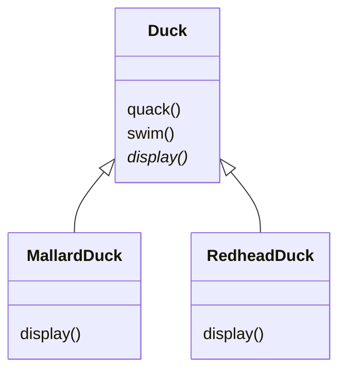
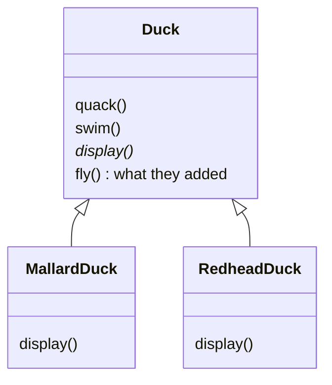
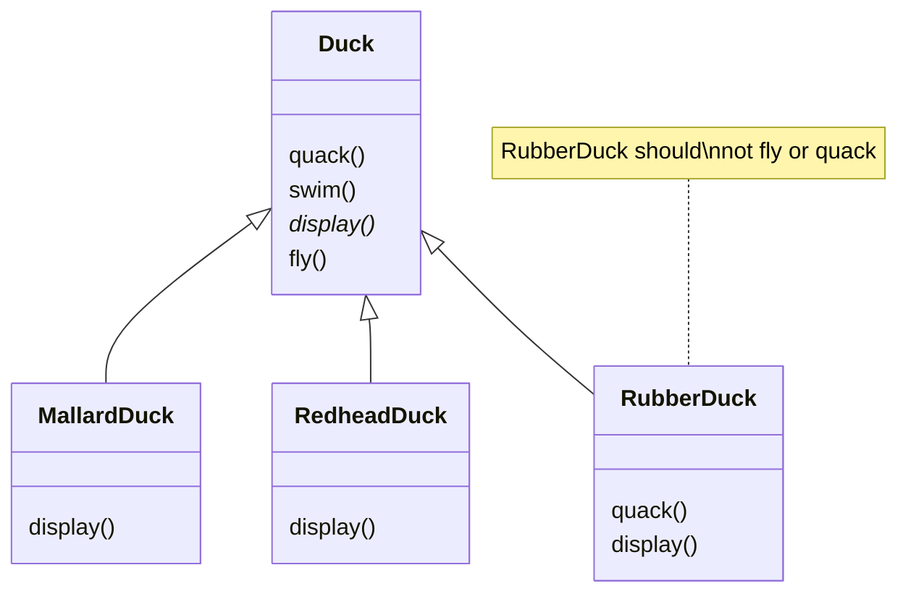
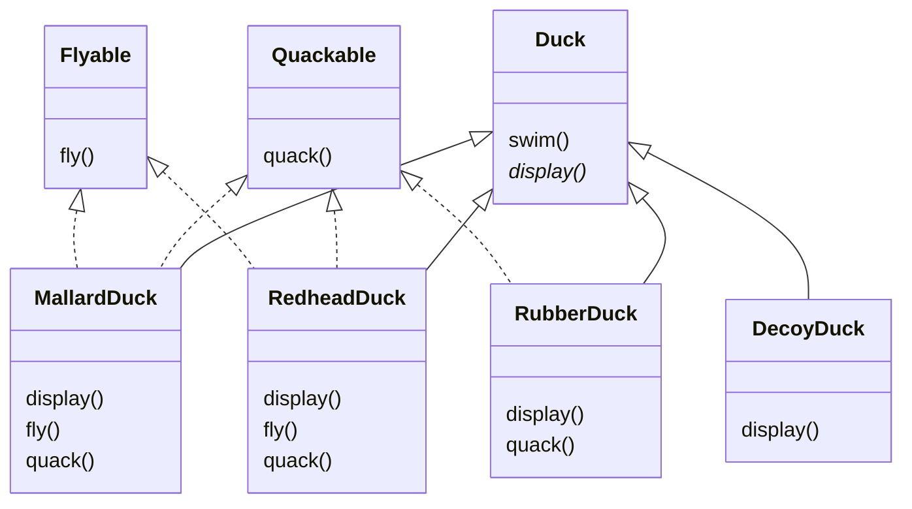
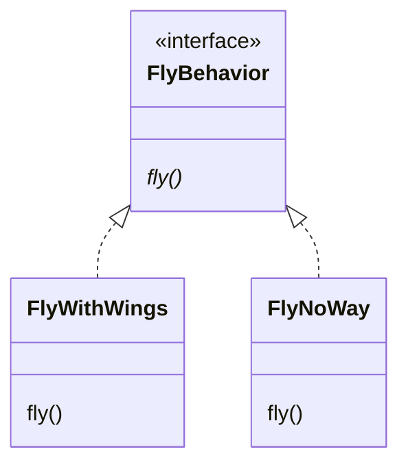

# 3.1 Overview of SimUDuck

&nbsp;&nbsp; SimUDuck is a highly successful duck pond simulation game. The game can show a large variety of duck species swimming and making quacking sounds. The initial designers used standard OO techniques and created one Duck superclass from which all other duck types inherit.

## a. We Need to Add Flying Ducks

&nbsp;&nbsp; The executives wanted to add a new feature to the simulator: flying ducks. So they just added a `fly()` method in the Duck class and then all the ducks inherited it. 

## b. Rubber Ducks Can't Fly

&nbsp;&nbsp; But they failed to notice that not *all* subclasses of Duck should *fly*. When they added a new behavior to the Duck superclass, they were also adding behavior that was *not* appropriate for some Duck subclasses.

&nbsp;&nbsp; The designers thought they could just override the `fly()` method in rubber duck to do nothing. But using inheritance to provide Duck behavior has disadvantages:

1. Code is duplicated across subclasses.
2. Runtime behavior changes are difficult.
3. It's hard to gain knowledge of all duck behaviors.
4. Changes can unintentionally affect other ducks.

&nbsp;&nbsp; In other words, this method violates the SOLID principles, specifically the **SRP** (Single Responsibility Principle), **OCP** (Open/Closed Principle), **LSP** (Liskov Substitution Principle), and **ISP** (Interface Segregation Principle).

> **SRP OCP LSP ISP**

## c. How about an Interface?

&nbsp;&nbsp; The designers decided to use interfaces to solve the problem. They created a `Flyable` interface and a `Quackable` interface. 

&nbsp;&nbsp; We know that not *all* of the subclasses should have flying or quacking behavior, so inheritance isn't the right answer. But while having the subclasses implement Flyable and Quackable solves *part* of the problem, it completely destroys code reuse for those behaviors, so it just creates a *different* maintenance problem. And of course there might be more than one kind of flying behavior.

> **SRP OCP ISP**

# 3.2 Strategy Pattern

&nbsp;&nbsp; The Java interfaces typically have no implementation code, so no code reuse. In either case, whenever you need to modify a behavior, you're often forced to track down and change it in all different sublcasses where that behavior is defined, probably introducing *new* bugs along the way.

> **Design Principle**
>
> Identify the aspects of your application that vary and separate them from what stays the same.

&nbsp;&nbsp; Here's another way to think about this principle: ***take ther parts that vary and encapsulate them, so that later you can alter or extend the parts that vary without affecting those that don't.***

## a. Separating What Changes from What Stays the Same

&nbsp;&nbsp; To seperate the "parts that change from those that stay the same", we're going to create two *sets* of classes (totally apart from Duck), one for *fly* and one for *quack*. Each set of classes will hold all the implementations of the respective behavior. For instance, we might have *one* class that implements *quacking*, *another* that implements *squeaking*, and *another* that implements *silence*.

## b. Designing the Duck Behaviors

> **Design Principle**
>
> Program to an interface, not an implementation.

&nbsp;&nbsp; We'll use an interface to represent each behavior—for instance, FlyBehavior and QuackBehavior—and each implementation of a *behavior* will implement one of those interfaces. 

&nbsp;&nbsp; So we'll make a set of classes whose entire reason for living is to represent a bahavior (for example, "squeaking"), and it's the *behavior* class, rather than the Duck class, that will implement the behavior interface.

&nbsp;&nbsp; With our new design,the Duck subclasses will use a behavior represented by and ***interface*** (FlyBehavior and QuackBehavior), so thatthe actual *implementation* of the behavior (in other words, the specific concrete behavior coded in the class that implements the FlyBehavior or QuackBehavior) won't be locked into the Duck subclass.

