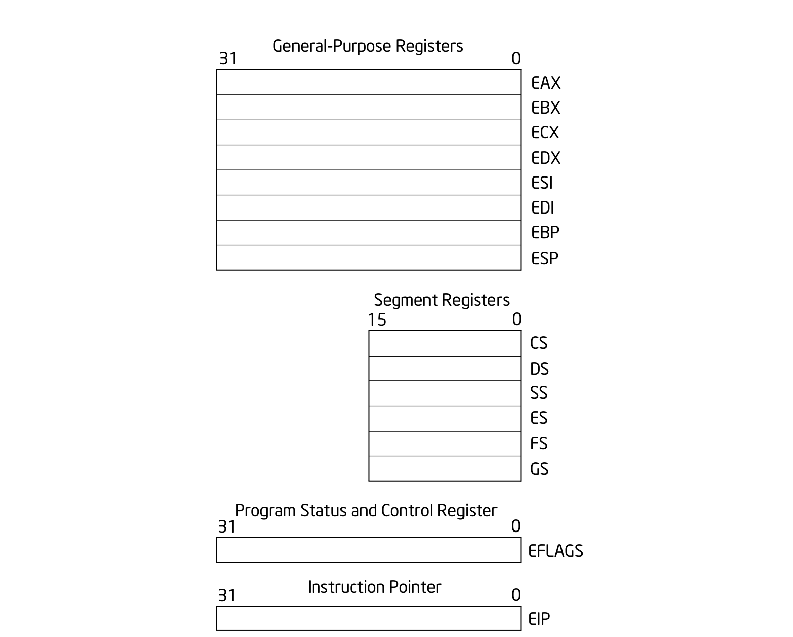
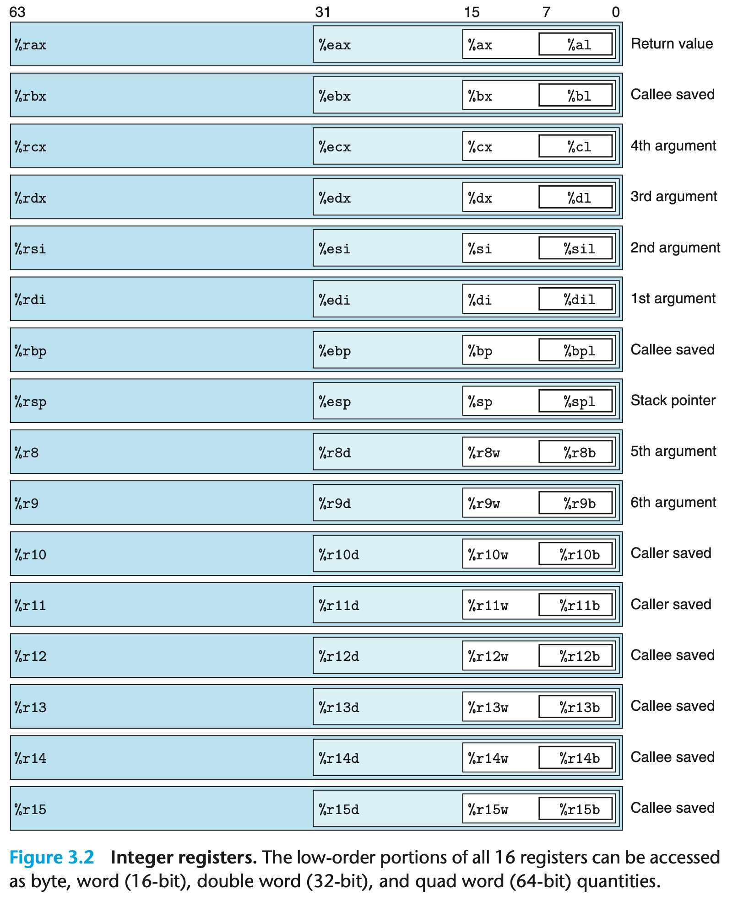

+++
date = '2026-02-28T16:30:15+09:00'
draft = false
title = 'General Purpose Registers'
categories = ['Intel']
+++
## 32-bit general-purpose registers

- 논리 연산 및 산술 연산을 위한 피연산자
- 주소 계산용 피연산자
- 메모리 포인터
- **ESP는 스택 포인터를 가지고 있으므로 다른 목적으로 사용해서는 안 됨**

| 레지스터 | 명칭 | 주요 용도 및 특수 기능 |
| --- | --- | --- |
| **EAX** | Accumulator | 산술 연산 결과 저장, 함수 리턴값, I/O 데이터 전송 |
| **EBX** | Base | 메모리 주소 지정(DS 세그먼트), 변환 테이블 베이스(`XLAT`) |
| **ECX** | Counter | 반복문(`LOOP`) 및 문자열 명령어(`REP`)의 카운터 |
| **EDX** | Data | 큰 수의 곱셈/나눗셈 시 상위 비트 저장, I/O 포트 주소 지정 |
| **ESI** | Source Index | 문자열 연산의 소스(출발지) 주소 포인터 |
| **EDI** | Dest. Index | 문자열 연산의 목적지 주소 포인터 |
| **EBP** | Base Pointer | 스택 프레임의 기준 주소 (함수 파라미터/지역변수 접근) |
| **ESP** | Stack Pointer | 현재 스택의 최상단 주소 (PUSH/POP에 의해 자동 변경) |

## 64-bit general-purpose registers

- **R8 ~ R15 (New GPRs)**
    - 추가된 범용 레지스터
    - 함수 호출 시 파라미터 전달이나 임시 데이터 저장 등 자유롭게 사용됨