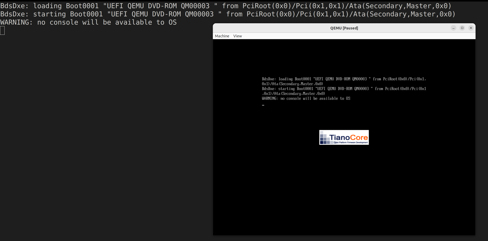
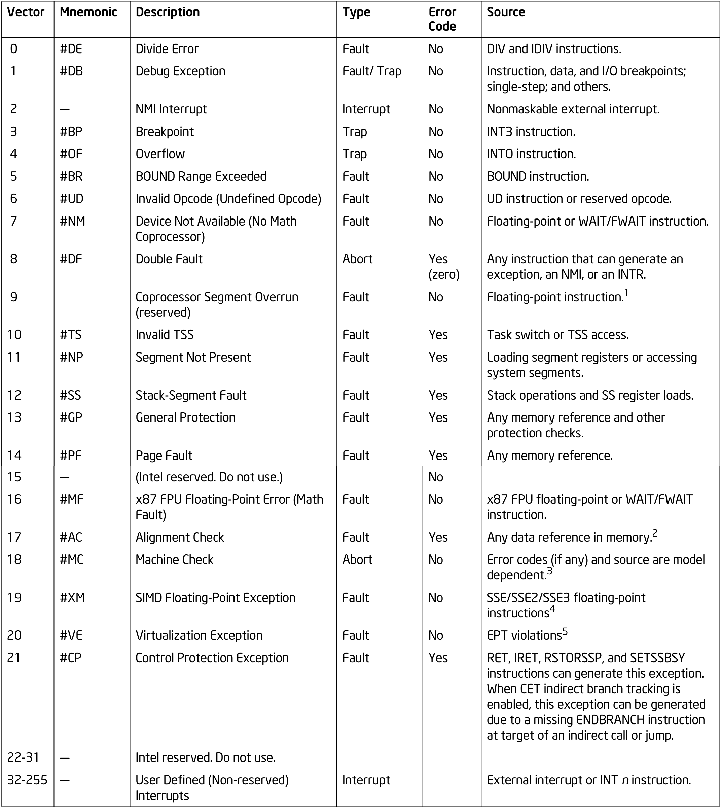
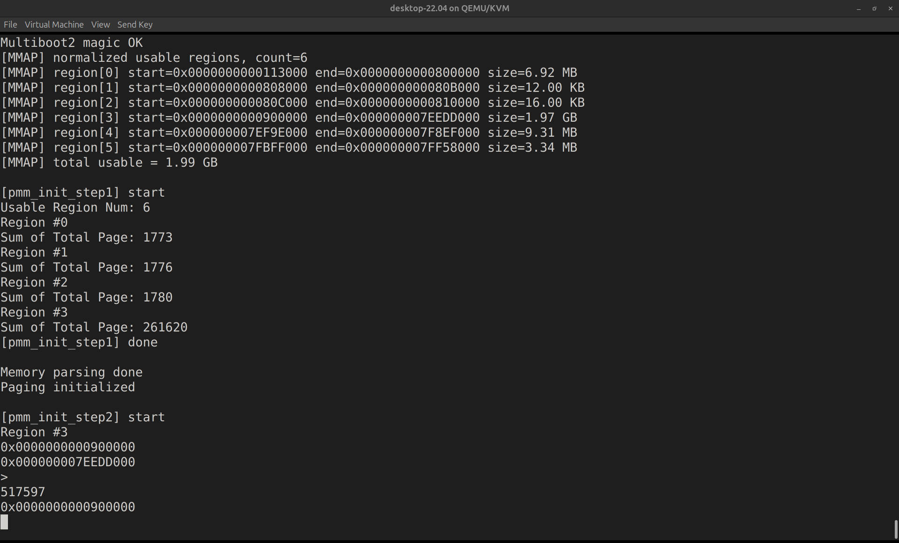
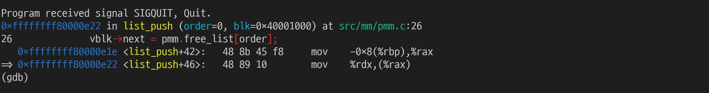
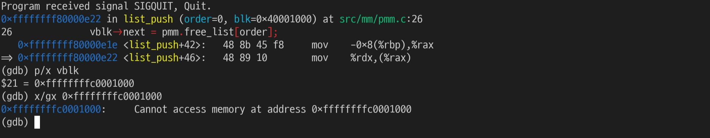
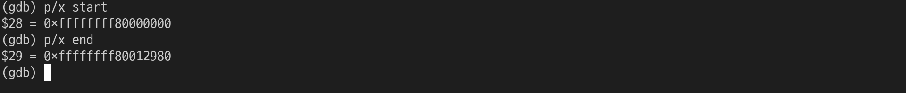

+++
date = '2026-03-29T18:50:18+09:00'
draft = false
title = 'Higher Half Kernel Troubleshooting'
categories = ['Project OS']
+++
# relocation truncated to fit: R_X86_64_32

## 증상

```bash
/opt/cross/bin/x86_64-elf-gcc -T linker.ld -o build/kernel.elf -ffreestanding -nostdlib -no-pie -Wl,--build-id=none -Wl,-z,noexecstack build/lib/string.o build/drivers/keyboard.o build/drivers/serial.o build/arch/x86_64/drivers/i8042.o build/arch/x86_64/gdt/gdt.o build/arch/x86_64/interrupt/pic.o build/arch/x86_64/interrupt/idt.o build/arch/x86_64/interrupt/isr_table.o build/mm/pmm.o build/mm/paging.o build/mm/pmm_tmp.o build/mm/vmm.o build/kernel/interrupt.o build/kernel/pit.o build/kernel/kmain.o build/kernel/exception.o build/kernel/early_alloc.o build/kernel/interrupt_init.o build/kernel/multiboot.o build/kernel/irq.o build/arch/x86_64/drivers/outb.o build/arch/x86_64/drivers/inb.o build/arch/x86_64/gdt/ltr_asm.o build/arch/x86_64/gdt/lgdt_asm.o build/arch/x86_64/interrupt/isr_stub.o build/arch/x86_64/interrupt/idt_load.o build/arch/x86_64/boot/boot.o -lgcc
/opt/cross/lib/gcc/x86_64-elf/11.5.0/../../../../x86_64-elf/bin/ld: warning: build/kernel.elf has a LOAD segment with RWX permissions
build/arch/x86_64/boot/boot.o: in function `_start':
(.text+0x9): relocation truncated to fit: R_X86_64_32 against symbol `__bss_end' defined in .bss section in build/kernel.elf
(.text+0xe): relocation truncated to fit: R_X86_64_32 against symbol `__bss_start' defined in .bss section in build/kernel.elf
(.text+0x19): relocation truncated to fit: R_X86_64_32 against `.bss'
(.text+0x22): relocation truncated to fit: R_X86_64_32 against `.data'
(.text+0x27): relocation truncated to fit: R_X86_64_32 against `.data'
(.text+0x2f): relocation truncated to fit: R_X86_64_32 against `.data'
(.text+0x34): relocation truncated to fit: R_X86_64_32 against `.data'
(.text+0x3c): relocation truncated to fit: R_X86_64_32 against `.data'
(.text+0x4a): relocation truncated to fit: R_X86_64_32 against `.data'
(.text+0x6b): relocation truncated to fit: R_X86_64_32 against `.text'
build/arch/x86_64/boot/boot.o: in function `gdt64_end':
(.data+0x301a): additional relocation overflows omitted from the output
collect2: error: ld returned 1 exit status
make: *** [Makefile:50: build/kernel.elf] Error 1
```

- 32-bit relocation(R_X86_64_32)으로 higher-half 주소를 참조하려고 해서 overflow 발생함

```bash
0xFFFFFFFF80000000 (KERNEL_VMA)
```

- 이 값은 32bit에 안 들어가기 때문에 linker가 relocation을 수행할 수 없어서 에러가 발생함

## 원인

```bash
(.text+0x9): relocation truncated to fit: R_X86_64_32 against symbol `__bss_end' defined in .bss section in build/kernel.elf
(.text+0xe): relocation truncated to fit: R_X86_64_32 against symbol `__bss_start' defined in .bss section in build/kernel.elf
```

```nasm
.code32
_start:
  cli
  cld
  /* Preserve Multiboot registers before clobbering general-purpose regs. */
  mov %eax, %esi   /* magic -> esi */
  mov %ebx, %edx   /* info  -> edx (edx is not clobbered by BSS init) */
  /* ES = DS (GRUB may leave ES undefined) */
  push %ds
  pop  %es
  /* Zero BSS so C globals are 0 and we do not rely on loader */
  mov  $__bss_end, %ecx
  mov  $__bss_start, %edi
```

- 위 코드에서는 32-bit immediate를 사용함
- 하지만 `__bss_end`, `__bss_start`는 64-bit 주소임 → 32-bit relocation으로 넣으려고 해서 overflow가 발생함

## 수정

### linker.ld

```
ENTRY(_start)

KERNEL_VMA = 0xFFFFFFFF80000000;
KERNEL_LMA = 0x100000;

SECTIONS
{
  . = KERNEL_VMA;

  _kernel_start = .;

  .multiboot2 ALIGN(8) : AT(KERNEL_LMA)
  {
    *(.multiboot2)
  }

  .text ALIGN(16) : AT(ADDR(.text) - KERNEL_VMA + KERNEL_LMA)
  {
    *(.text*)
  }

  .rodata ALIGN(16) : AT(ADDR(.rodata) - KERNEL_VMA + KERNEL_LMA)
  {
    *(.rodata*)
  }

  .data ALIGN(16) : AT(ADDR(.data) - KERNEL_VMA + KERNEL_LMA)
  {
    *(.data*)
  }

  .bss ALIGN(16) : AT(ADDR(.bss) - KERNEL_VMA + KERNEL_LMA)
  {
    __bss_start = .;
    *(COMMON) *(.bss*)
    __bss_end = .;
  }

  _kernel_end = ALIGN(4096);

  __bss_start_phys = LOADADDR(.bss);
  __bss_end_phys   = LOADADDR(.bss) + SIZEOF(.bss);

  stack_top_phys = LOADADDR(.bss) + (stack_top - ADDR(.bss));
  stack_bottom_phys = LOADADDR(.bss) + (stack_bottom - ADDR(.bss));

  pml4_phys = LOADADDR(.data) + (pml4 - ADDR(.data));
  pdpt_phys = LOADADDR(.data) + (pdpt - ADDR(.data));
  pd_phys   = LOADADDR(.data) + (pd   - ADDR(.data));

  gdt64_phys = LOADADDR(.data) + (gdt64 - ADDR(.data));
  gdt64_desc_phys = LOADADDR(.data) + (gdt64_desc - ADDR(.data));
}
```

- linker.ld에 물리 주소 심볼 추가
- `.code32`에서 사용할 모든 symbol의 physical 메모리 주소를 정의함

### boot.s

```nasm
.code32
_start:
  cli
  cld
  /* Preserve Multiboot registers before clobbering general-purpose regs. */
  mov %eax, %esi   /* magic -> esi */
  mov %ebx, %edx   /* info  -> edx (edx is not clobbered by BSS init) */
  /* ES = DS (GRUB may leave ES undefined) */
  push %ds
  pop  %es
  /* Zero BSS so C globals are 0 and we do not rely on loader */
  mov $__bss_end_phys, %ecx
  mov $__bss_start_phys, %edi
  sub  %edi, %ecx
  xor  %eax, %eax
  rep  stosb
  mov  $stack_top_phys, %esp
  /* Save preserved Multiboot magic/info for 64-bit entry. */
  push %edx   /* info  -> [rsp+4] after next push */
  push %esi   /* magic -> [rsp]                   */

  lgdt gdt64_desc_phys

  /* pml4[0] -> pdpt */
  movl $pdpt_phys, %eax
  orl  $0x003, %eax
  movl %eax, pml4_phys

  /* pdpt[0] -> pd */
  movl $pd_phys, %eax
  orl  $0x003, %eax
  movl %eax, pdpt_phys

  /* CR4.PAE=1 */
  mov %cr4, %eax
  or  $0x20, %eax
  mov %eax, %cr4

  /* CR3 = pml4 */
  movl $pml4_phys, %eax
  mov %eax, %cr3

  /* EFER.LME=1 */
  mov $0xC0000080, %ecx
  rdmsr
  or  $0x00000100, %eax
  wrmsr

  /* CR0.PG=1 */
  mov %cr0, %eax
  or  $0x80000000, %eax
  mov %eax, %cr0

  ljmp $0x08, $start64
```

- `boot.s`에서 `.code32` 내의 32-bit 주소를 모두 `linker.ld`에서 정의한 심볼로 수정

# linker visibility 문제

## 증상/원인

```bash
opt/cross/lib/gcc/x86_64-elf/11.5.0/../../../../x86_64-elf/bin/ld:linker.ld:44: undefined symbol `stack_top' referenced in expression
collect2: error: ld returned 1 exit status
make: *** [Makefile:50: build/kernel.elf] Error 1
```

- `linker.ld`에서 `stack_top`을 참조했는데, 해당 심볼이 그 시점에 존재하지 않아서 발생함

## 수정

```nasm
/* stack can be in .bss (zeroed) */
.section .bss
.align 16

.global stack_bottom
.global stack_top

stack_bottom:
  .skip 16384
stack_top:
```

- stack 심볼을 global로 노출시킴

```nasm
/* tables contain non-zero initial values -> keep them in .data */
.section .data
.align 4096

.global pml4
pml4:
  .quad 0
  .skip 4096-8

.align 4096
.global pdpt
pdpt:
  .quad 0
  .skip 4096-8

.align 4096
.global pd
pd:
  /* 512 entries, each maps 2MiB: addr | present|rw|ps(2MiB) = 0x83 */
  .set i, 0
  .rept 512
    .quad (i * 0x200000) + 0x83
    .set i, i+1
  .endr
```

```nasm
.global gdt64
.global gdt64_end
.global gdt64_desc

gdt64:
  .quad 0
  .quad 0x00AF9A000000FFFF
  .quad 0x00AF92000000FFFF
gdt64_end:

gdt64_desc:
  .word gdt64_end - gdt64 - 1
  .long gdt64
```

- 마찬가지로 나머지 심볼도 global로 노출시킴

# `.text` relocation

## 증상

```bash
/opt/cross/lib/gcc/x86_64-elf/11.5.0/../../../../x86_64-elf/bin/ld: warning: build/kernel.elf has a LOAD segment with RWX permissions
build/arch/x86_64/boot/boot.o: in function `_start':
(.text+0x6b): relocation truncated to fit: R_X86_64_32 against `.text'
collect2: error: ld returned 1 exit status
make: *** [Makefile:50: build/kernel.elf] Error 1
```

## 원인

```bash
ljmp $0x08, $start64
```

- 내부적으로 `start64` 주소를 32bit immediate로 encode함
    - 하지만 `start64`는 VMA = `0xFFFFFFFF8000xxxx`이므로 32bit에 안 들어가서 overflow가 발생함

## 수정

### linker.ld

```
  start64_phys = LOADADDR(.text) + (start64 - ADDR(.text));
}
```

- `start64`의 물리 주소를 계산하는 코드를 추가
- low identity 영역에 trampoline label을 하나 추가함

```nasm
jmp long_mode_entry

long_mode_entry:
  pushl $0x08
  pushl $start64_phys
  lret

.global start64

.code64
start64:
  mov $0x10, %ax
  mov %ax, %ds
  mov %ax, %es
/* ... 하위 로직 동일 ... */
```

## 결과



- 기존에 `kmain.c`에 구현한 초기화 코드는 실행되진 않았지만 부팅까진 성공함

# Triple fault

## 증상

```
check_exception old: 0xffffffff new 0x6
   128: v=06 e=0000 i=0 cpl=0 IP=0008:ffffffff8000247c pc=ffffffff8000247c SP=0010:00000000001119c0 env->regs[R_EAX]=000000007fffa46f
RAX=000000007fffa46f RBX=00000000ffe00083 RCX=00000000c0000080 RDX=0000000000000000
RSI=000000000001b000 RDI=0000000036d76289 RBP=0000000000000000 RSP=00000000001119c0
R8 =000000007bbb93e0 R9 =000000007bbb9060 R10=000000000000000f R11=000000007e52e5a1
R12=00000000000000f0 R13=000000007bd205a0 R14=0000000000000000 R15=000000007bebf5e0
RIP=ffffffff8000247c RFL=00200807 [-O---PC] CPL=0 II=0 A20=1 SMM=0 HLT=0
ES =0010 0000000000000000 ffffffff 00af9300 DPL=0 DS   [-WA]
CS =0008 0000000000000000 ffffffff 00af9a00 DPL=0 CS64 [-R-]
SS =0010 0000000000000000 ffffffff 00af9300 DPL=0 DS   [-WA]
DS =0010 0000000000000000 ffffffff 00af9300 DPL=0 DS   [-WA]
FS =0010 0000000000000000 ffffffff 00af9300 DPL=0 DS   [-WA]
GS =0010 0000000000000000 ffffffff 00af9300 DPL=0 DS   [-WA]
LDT=0000 0000000000000000 0000ffff 00008200 DPL=0 LDT
TR =0000 0000000000000000 0000ffff 00008b00 DPL=0 TSS64-busy
GDT=     000000000010a000 00000017
IDT=     000000007f470018 00000fff
CR0=80010033 CR2=0000000000000000 CR3=0000000000104000 CR4=00000668
DR0=0000000000000000 DR1=0000000000000000 DR2=0000000000000000 DR3=0000000000000000 
DR6=00000000ffff0ff0 DR7=0000000000000400
CCS=ffffffffffff8000 CCD=ffffffff7fffa46f CCO=ADDL
EFER=0000000000000d00

check_exception old: 0xffffffff new 0xd
   129: v=0d e=0038 i=0 cpl=0 IP=0008:ffffffff8000247c pc=ffffffff8000247c SP=0010:00000000001119c0 env->regs[R_EAX]=000000007fffa46f
RAX=000000007fffa46f RBX=00000000ffe00083 RCX=00000000c0000080 RDX=0000000000000000
RSI=000000000001b000 RDI=0000000036d76289 RBP=0000000000000000 RSP=00000000001119c0
R8 =000000007bbb93e0 R9 =000000007bbb9060 R10=000000000000000f R11=000000007e52e5a1
R12=00000000000000f0 R13=000000007bd205a0 R14=0000000000000000 R15=000000007bebf5e0
RIP=ffffffff8000247c RFL=00200807 [-O---PC] CPL=0 II=0 A20=1 SMM=0 HLT=0
ES =0010 0000000000000000 ffffffff 00af9300 DPL=0 DS   [-WA]
CS =0008 0000000000000000 ffffffff 00af9a00 DPL=0 CS64 [-R-]
SS =0010 0000000000000000 ffffffff 00af9300 DPL=0 DS   [-WA]
DS =0010 0000000000000000 ffffffff 00af9300 DPL=0 DS   [-WA]
FS =0010 0000000000000000 ffffffff 00af9300 DPL=0 DS   [-WA]
GS =0010 0000000000000000 ffffffff 00af9300 DPL=0 DS   [-WA]
LDT=0000 0000000000000000 0000ffff 00008200 DPL=0 LDT
TR =0000 0000000000000000 0000ffff 00008b00 DPL=0 TSS64-busy
GDT=     000000000010a000 00000017
IDT=     000000007f470018 00000fff
CR0=80010033 CR2=0000000000000000 CR3=0000000000104000 CR4=00000668
DR0=0000000000000000 DR1=0000000000000000 DR2=0000000000000000 DR3=0000000000000000 
DR6=00000000ffff0ff0 DR7=0000000000000400
CCS=ffffffffffff8000 CCD=ffffffff7fffa46f CCO=ADDL
EFER=0000000000000d00

check_exception old: 0xd new 0xd
   130: v=08 e=0000 i=0 cpl=0 IP=0008:ffffffff8000247c pc=ffffffff8000247c SP=0010:00000000001119c0 env->regs[R_EAX]=000000007fffa46f
RAX=000000007fffa46f RBX=00000000ffe00083 RCX=00000000c0000080 RDX=0000000000000000
RSI=000000000001b000 RDI=0000000036d76289 RBP=0000000000000000 RSP=00000000001119c0
R8 =000000007bbb93e0 R9 =000000007bbb9060 R10=000000000000000f R11=000000007e52e5a1
R12=00000000000000f0 R13=000000007bd205a0 R14=0000000000000000 R15=000000007bebf5e0
RIP=ffffffff8000247c RFL=00200807 [-O---PC] CPL=0 II=0 A20=1 SMM=0 HLT=0
ES =0010 0000000000000000 ffffffff 00af9300 DPL=0 DS   [-WA]
CS =0008 0000000000000000 ffffffff 00af9a00 DPL=0 CS64 [-R-]
SS =0010 0000000000000000 ffffffff 00af9300 DPL=0 DS   [-WA]
DS =0010 0000000000000000 ffffffff 00af9300 DPL=0 DS   [-WA]
FS =0010 0000000000000000 ffffffff 00af9300 DPL=0 DS   [-WA]
GS =0010 0000000000000000 ffffffff 00af9300 DPL=0 DS   [-WA]
LDT=0000 0000000000000000 0000ffff 00008200 DPL=0 LDT
TR =0000 0000000000000000 0000ffff 00008b00 DPL=0 TSS64-busy
GDT=     000000000010a000 00000017
IDT=     000000007f470018 00000fff
CR0=80010033 CR2=0000000000000000 CR3=0000000000104000 CR4=00000668
DR0=0000000000000000 DR1=0000000000000000 DR2=0000000000000000 DR3=0000000000000000 
DR6=00000000ffff0ff0 DR7=0000000000000400
CCS=ffffffffffff8000 CCD=ffffffff7fffa46f CCO=ADDL
EFER=0000000000000d00
check_exception old: 0x8 new 0xd
Triple fault
```

- `ffffffff8000247c` 위치의 코드를 실행할 때 트리플 폴트 발생



- 예외 발생 순서
    - `v=06` (Invalid Opcode): RIP=ffffffff8000247c CR3=0000000000104000
    - `v=0d` (General Protection)
    - `v=08` (Double Fault)
    - Triple Fault

```bash
$ objdump -h /home/bogamie/mini-dOs/build/kernel.elf | head -20

/home/bogamie/mini-dOs/build/kernel.elf:     file format elf64-x86-64

Sections:
Idx Name          Size      VMA               LMA               File off  Algn
  0 .multiboot2   00000018  ffffffff80000000  0000000000100000  00001000  2**3
                  CONTENTS, ALLOC, LOAD, READONLY, DATA
  1 .text         00002457  ffffffff80000020  0000000000100020  00001020  2**4
                  CONTENTS, ALLOC, LOAD, READONLY, CODE
  2 .rodata       00000347  ffffffff80002480  0000000000102480  00003480  2**5
                  CONTENTS, ALLOC, LOAD, READONLY, DATA
  3 .eh_frame     000005a4  ffffffff800027c8  00000000001027c8  000037c8  2**3
                  CONTENTS, ALLOC, LOAD, READONLY, DATA
  4 .data         000072ae  ffffffff80002d70  0000000000102d70  00003d70  2**4
                  CONTENTS, ALLOC, LOAD, DATA
  5 .bss          000079a0  ffffffff8000a020  000000000010a020  0000b01e  2**5
                  ALLOC
  6 .debug_info   00006655  0000000000000000  0000000000000000  0000b01e  2**0
                  CONTENTS, READONLY, DEBUGGING, OCTETS
  7 .debug_abbrev 00001d64  0000000000000000  0000000000000000  00011673  2**0
```

- `.text` 섹션은 `ffffffff80002477`(0xffffffff80000020+0x2457)에서 끝나는데 `RIP`가 `ffffffff8000247c`(.text 끝 바로 뒤 패딩 영역)에서 #UD가 발생함

## 원인

- 페이지 테이블 매핑과 링커 VMA의 불일치로 발생함
- 링커는 VMA `0xFFFFFFFF80000000`를 LMA `0x100000`로 로드함
- 반면 페이지 테이블은 PDPT[510] → PD로, 0xFFFFFFFF80000000을 물리 `0x0`에 매핑함
- 이로 인해 `higher_half_entry(0xFFFFFFFF8000246f)`로 점프하면 CPU는 물리 `0x246f`를 실행하여 커널 코드가 없는 이상한 주소에 접근함
- 실제 커널 코드는 `0x10246f`에 있지만, 페이지 테이블은 `0x246f`를 가리키게 되어 triple fault가 발생함

> 현재 페이징은 PML4 → PDPT → PD까지 진행하여 2MiB huge page를 사용함

0xFFFFFFFF80000000 = 1111 1111 1111 | 1111 1111 1111 1111 | 1000 0000 0000 0000 | 0000 0000 0000 0000

PML4 index = 0b1 1111 1111 = 511
PDPT index = 0b1 1111 1110 = 510
     PD index = 0b0 0000 0000
     PT index = 0b0 0000 0000

따라서 0xFFFFFFFF80000000는 PML4의 511에, PDPT의 510, PD의 첫 엔트리부터 시작하는 주소임
> 

## 수정

```
ENTRY(_start)

KERNEL_VMA = 0xFFFFFFFF80000000;

SECTIONS
{
  . = KERNEL_VMA;

  _kernel_start = .;

  .multiboot2 ALIGN(8) : AT(ADDR(.multiboot2) - KERNEL_VMA)
  {
    *(.multiboot2)
  }

  .text ALIGN(16) : AT(ADDR(.text) - KERNEL_VMA)
  {
    *(.text*)
  }

  .rodata ALIGN(16) : AT(ADDR(.rodata) - KERNEL_VMA)
  {
    *(.rodata*)
  }

  .data ALIGN(16) : AT(ADDR(.data) - KERNEL_VMA)
  {
    *(.data*)
  }

  .bss ALIGN(16) : AT(ADDR(.bss) - KERNEL_VMA)
  {
    __bss_start = .;
    *(COMMON) *(.bss*)
    __bss_end = .;
  }

  _kernel_end = ALIGN(4096);

  __bss_start_phys = LOADADDR(.bss);
  __bss_end_phys   = LOADADDR(.bss) + SIZEOF(.bss);

  stack_top_phys = LOADADDR(.bss) + (stack_top - ADDR(.bss));
  stack_bottom_phys = LOADADDR(.bss) + (stack_bottom - ADDR(.bss));

  pml4_phys = LOADADDR(.data) + (pml4 - ADDR(.data));
  pdpt_phys = LOADADDR(.data) + (pdpt - ADDR(.data));
  pd_phys   = LOADADDR(.data) + (pd   - ADDR(.data));
  pd1_phys  = LOADADDR(.data) + (pd1  - ADDR(.data));
  pd2_phys  = LOADADDR(.data) + (pd2  - ADDR(.data));
  pd3_phys  = LOADADDR(.data) + (pd3  - ADDR(.data));

  gdt64_phys = LOADADDR(.data) + (gdt64 - ADDR(.data));
  gdt64_desc_phys = LOADADDR(.data) + (gdt64_desc - ADDR(.data));

  start64_phys = LOADADDR(.text) + (start64 - ADDR(.text));
}
```

- `KERNEL_LMA`를 제거하고 LMA를 `ADDR(.section) - KERNEL_VMA`로 계산하도록 변경하여, 링커의 물리 주소(LMA)가 페이지 테이블의 매핑과 일치하도록 수정

## 결과


- 전에 실행되지 않던 kmain.c의 시리얼이 출력됨!!!

# Multiboot2 parsing 실패

## 증상

- 바로 위 스크린샷에서 볼 수 있듯이 사용 가능한 영역의 개수와 크기가 모두 0임을 확인할 수 있음

## 디버깅

- GDB를 통해 해당 문제를 분석해보자


### `mb_info`


- multiboot_parse()를 호출할 때 인자로 넘겨주는 mb_info를 확인해봄

```
0x1a000: 0x00001fb8 0x00000000
```

- total_size = 0x1fb8이라는 것을 확인할 수 있으며 0으로 채워진 reserved 영역을 볼 수 있음

```
0x1a048:        0x00000006      0x000001c0      0x00000018      0x00000000
```

- type = 0x00000006으로 mmap에 해당함
- size = 0x000001c0

```
0x1a058:        0x00000000      0x00000000      0x000a0000      0x00000000
```

- addr = 0x00000000_00000000
- len = 0x00000000_000a0000 (640KB)
- type = 1로 사용 가능한 영역임

- mb_info는 정상적으로 넘겨주고 있으며 여기서 문제 없음을 확인함
- 이 구조를 파싱하는 코드에 문제가 있다고 보여짐

#### 의심 코드

```
static void remove_reserved_regions(void *mb_info) {
    uint64_t kernel_end = (uint64_t)_kernel_end;
    uint64_t early_end  = kernel_end + EARLY_ALLOC_SIZE;

    uint64_t mbi_start = (uint64_t)mb_info;
    uint32_t total_size = *(uint32_t *)mb_info;
    uint64_t mbi_end   = mbi_start + total_size;

    uint32_t new_count = 0;

    for (uint32_t i = 0; i < usable_region_count; i++) {
        uint64_t start = usable_regions[i].start;
        uint64_t end   = usable_regions[i].end;

        // Fully covered by kernel/early alloc → discard
        if (end <= early_end)
            continue;

        // Trim overlap with kernel/early alloc
        if (start < early_end && end > early_end)
            start = early_end;

        // Fully inside multiboot info → discard
        if (start >= mbi_start && end <= mbi_end)
            continue;
```

- MBI를 파싱하는 코드에 예약된 영역을 지우는 함수(remove_reserved_regions)가 있는데 여기서 가상 주소와 물리 주소를 비교함
- higher-half kernel로 수정해서 `_kernel_end`가 매우 크므로 물리 주소와 비교하면 항상 물리 주소가 작음
    - 이것 때문에 사용 가능한 영역이 없다고 판단하는 것 같음

### remove_reserved_regions


- for문 첫번째 순회에서의 `start`, `end` 값과 `kernel_end` 값을 출력함
- 이를 통해 가상 주소와 물리 주소를 직접 비교하여 문제가 발생한다는 가정을 증명함

## 수정

```c
#define KERNEL_BASE 0xFFFFFFFF80000000ULL

uint64_t kernel_end = (uint64_t)_kernel_end - KERNEL_BASE;
```

- 커널의 가상 시작 주소를 명시하고 `kernel_end` 값에 가상 시작 주소를 빼는 방식으로 수정함

## 결과



- 파싱 완료되어 정상적으로 사용 가능 영역을 출력하고 pmm_init_step2까지 실행하다가 멈춤

# pmm_init_step2 중단

## 증상



- pmm_init_step2의 `list_push`에서 잘못된 포인터(`%rax`)에 쓰기를 시도하면서 메모리 오류 발생

## 디버깅

```c
static void list_push(uint32_t order, block_t* blk) {
	block_t* vblk = (block_t*)phys_to_virt((uintptr_t)blk);
	vblk->next = pmm.free_list[order];	
	pmm.free_list[order] = blk;
}
```

- 우선 `list_push`는 free 상태인 블록을 `free_list`에 추가하는 함수임
- 인자로 받는 `blk`는 물리 주소이기 때문에 직접 접근할 수 없음
- 따라서 `phys_to_virt`로 가상 주소(`vblk`)를 구해서 `next` 포인터를 설정함
- 단, `free_list[order]`에는 물리 주소(`blk`)를 그대로 저장함 — 리스트 자체는 물리 주소 기반으로 관리되고, 접근할 때만 가상 주소로 변환하는 구조



- gdb에서 `vblk`의 값을 출력하고 그 값에 접근해봄
- 접근 불가로 뜨기 때문에 해당 VA는 현재 page table에서 valid mapping이 없다는 것을 파악함

→ 즉, `paging_init`에서 문제가 있음

```c
uint64_t start = (uint64_t)kernel_vma();
uint64_t end   = (uint64_t)kernel_vma_end() + EARLY_ALLOC_SIZE; // 커널과 early_alloc 영역 모두 매핑
```

- `paging_init`은 커널 이미지 영역만 매핑함



- gdb로 매핑하는 영역의 시작, 끝 주소를 확인하면 위와 같음
- 하지만 `vblk`는 0xffffffffc0001000이므로 매핑 영역의 바깥임

## 결론

- 리눅스 커널은 부팅 초기에 물리 메모리의 사용 가능 영역 전체를 huge page 단위로 매핑해두기 때문에 PMM이 어떤 물리 주소를 받아도 대응하는 가상 주소로 접근할 수 있음
- 반면 현재 코드는 `paging_init`에서 커널 이미지 + `early_alloc` 영역만 매핑하고 있음
- 그래서 `pmm_init_step2`가 `PMM_STEP_LIMIT` 이후의 물리 주소를 `list_push`에 넘기면 `phys_to_virt`로 변환한 가상 주소가 매핑되지 않은 영역을 가리키게 되어 쓰기 시도 시 페이지 폴트가 발생한 것
- 다음 글에서는 usable region 전체를 huge page로 매핑하는 작업을 구현하고, 그 위에서 PMM 초기화가 정상 동작하는 것까지 확인할 예정