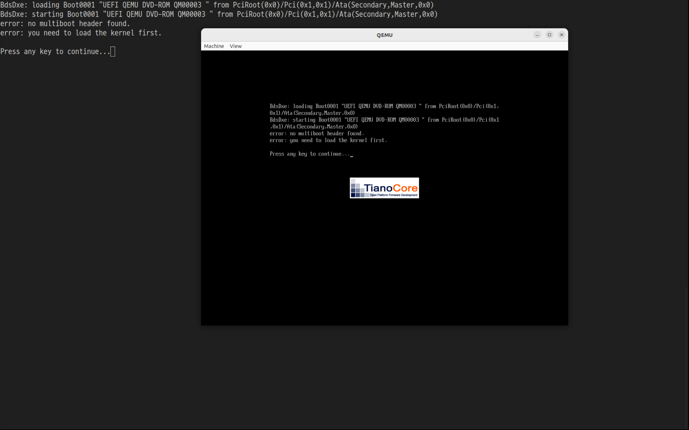

+++
date = '2026-03-18T19:39:22+09:00'
draft = false
title = 'Multiboot2 Memory Map Parsing Implementation'
categories = ['Project OS']
+++

## 현재 상태
    - GRUB + Multiboot2로 IA32e mode로 진입 완료
    - GDT, IDT, 인터럽트 기본 동작

## 목표

```
[Bootloader (GRUB)]
        ↓
[Multiboot2 raw data]
        ↓
[Boot parsing layer]
        ↓
[usable memory list]
        ↓
[PMM]
        ↓
[page allocator]
```
    

# Multiboot2 memory map 파싱

- 부트로더(GRUB)가 전달한 물리 메모리 배치 정보를 읽어 커널이 사용할 수 있는 RAM 영역을 구분하기 위해 수행함
- 커널은 부팅 직후 전체 RAM 크기, 사용 가능한 RAM 구간, 예약된 메모리 영역을 스스로 알 수 없으므로 GRUB에게 받은 Multiboot2 information structure로 파악함

## Multiboot2 information 구조

- 우리가 봐야하는 구조체는 세 가지임

### **Basic tags structure**

```
        ┌───────────────────┐
u32     │ total_size        │
u32     │ reserved          │
	│ tag list 시작      │
        └───────────────────┘
```

- 부트 정보는 고정된 8byte 헤더로 시작하고 그 뒤에 여러 태그들이 8byte 정렬 상태로 연속해서 붙음
- `total_size` : 해당 필드 자체와 맨 마지막에 위치할 terminating 태그를 모두 포함한 부트 정보 구조체 전체의 크기(byte 크기)를 나타냄
- `reserved` : 항상 0으로 설정되어 OS 이미지는 이 값을 무시해야 함
- 태그 목록 시작: 이후 모든 태그는 type과 size 필드로 시작하며 마지막은 type = 0, size = 8을 가지는 terminating 태그로 마무리됨

### **Memory map**

- 부트로더가 파악한 시스템의 물리 메모리 배치 상태를 OS에 전달하는 태그

```
        ┌───────────────────┐
u32     │ type = 6          │
u32     │ size              │
u32     │ entry_size        │
u32     │ entry_version     │
varies  │ entries           │
        └───────────────────┘
```

- `type` : 메모리 맵 태그를 식별하는 번호로 항상 6임
- `size` : 태그 헤더와 뒤따르는 엔트리 배열을 모두 포함한 Memory 태그 전체의 크기
- `entry_size` : `entries`  배열에 들어있는 개별 메모리 엔트리의 1개의 크기
- `entry_version` : 현재 엔트리 버전은 0으로 설정되어 있음
- `entries` : 실제 메모리 영역들의 정보가 담긴 엔트리 구조체의 배열

### memory entry

- 시스템에 존재하는 각 메모리 구간의 시작 주소, 크기, 용도를 정의함

```
        ┌───────────────────┐
u64     │ base_addr         │
u64     │ length            │
u32     │ type              │
u32     │ reserved          │
        └───────────────────┘
```

- `base_addr` : 해당 메모리 영역이 시작되는 64bits 물리 주소
- `length` : 해당 메모리 영역의 크기(byte)
- `type` : 해당 메모리 영역의 종류를 나타냄
    - `1` : 일반적인 용도로 사용 가능한 RAM
        - 이 영역 내에는 현재 실행 중인 커널 이미지, Multiboot2 info 구조체 등이 적재되어 있을 수 있음
        - 커널 메모리 관리자를 초기화할 때는 유의해야 함
    - `3` : ACPI(Advanced Configuration and Power Interface) 정보를 담고 있는 사용 가능한 메모리
    - `4` : 최대 절전 모드 상태를 위해 보존되어야 하는 예약된 메모리
    - `5` : 결함이 있는 RAM 모듈이 차지하고 있는 사용할 수 없는 메모리
    - 이 외의 값은 예약된 영역을 의미하므로 OS가 함부로 사용하면 안 됨

## Multiboot2 tag 순회

- Multiboot2 info는 단일 구조체가 아니라 tag들의 리스트이므로 원하는 정보를 얻으려면 tag를 순회하면서 찾아야 함
- **순회 방식**
    - mb_info + 8부터 시작(total_size + reserved)
    
    → tag.type 확인
    
    → 원하는 tag 찾기
    
    → 다음 tag로 이동(`next_tag = current_tag + ALIGN_UP(size, 8)`)
    
    → type == 0이면 종료
    

# 구현

## early allocator

- 파싱 후 결과를 저장할 배열을 메모리에 생성해야 함
- 배열 크기를 32개로 고정할 수도 있지만 부팅되는 환경에 따라 파싱되는 개수가 변할 수 있음

→ 따라서 파싱 개수를 세고 그 크기만큼 동적 메모리 할당을 하는 early allocator를 구현해야 함

- early allocator는 부팅 초기에만 쓰기 때문에 매우 간단한 기능을 가짐
    - free 없음
    - page alignment 지원

### linker.ld

```
// linker.ld
ENTRY(_start)

SECTIONS
{
  . = 1M;

  .multiboot2 : ALIGN(8) { *(.multiboot2) }

  .text : ALIGN(16) { *(.text*) }
  .rodata : ALIGN(16) { *(.rodata*) }
  .data : ALIGN(16) { *(.data*) }
  .bss : ALIGN(16) {
    __bss_start = .;
    *(COMMON) *(.bss*)
    __bss_end = .;
  }

  _end = ALIGN(4096);
}
```
- 동적으로 할당할 메모리는 kernel 끝 이후 공간에 씀
- `linker.ld`에 `_end = ALIGN(4096);`를 추가하여 kernel이 차지한 메모리의 끝을 명시함

### early_alloc.c

```c
#include <early_alloc.h>
#include <cpu.h>

extern uint8_t _end[];            // End of kernel image (from linker)

static uint8_t *early_current;  // Next allocation position
static uint8_t *early_end;      // Allocation limit

// Round address up to the next multiple of 'align' (power of two)
static uintptr_t align_up(uintptr_t addr, size_t align) {
    return (addr + align - 1) & ~(align - 1);
}

void init_early_alloc(void) {
    early_current = _end;
    early_end = early_current + EARLY_ALLOC_SIZE; // Reserve 1MB for early allocations
}

// Simple bump allocator: linear allocation, no free
void *early_alloc(size_t size, size_t align) {
    uintptr_t curr = (uintptr_t)early_current;

    // Ensure returned address satisfies alignment
    curr = align_up(curr, align);

    uintptr_t next = curr + size;

    // Stop if out of reserved memory
    if (next > (uintptr_t)early_end) {
        hlt();
    }

    early_current = (uint8_t *)next;
    
    return (void *)curr;
}
```

- 커널 초기화 단계에서 사용하는 **정렬을 지원하는 선형 메모리 할당기**
- 포인터를 정수(`uintptr_t`)로 변환해 alignment를 계산하고 단순히 포인터를 증가시키는 방식으로 메모리를 관리함

### multiboot.c

```c
#include <early_alloc.h>
#include <multiboot2.h>
#include <multiboot.h>

extern uint8_t _end;

memory_region_t *usable_regions;
uint32_t usable_region_count;

// Utility
static uint64_t align_up(uint64_t addr) {
    return (addr + 0xFFF) & ~0xFFF;
}

static uint64_t align_down(uint64_t addr) {
    return addr & ~0xFFF;
}

// Count MULTIBOOT_MEMORY_AVAILABLE entries
static uint32_t count_usable_regions(struct multiboot_tag_mmap *mmap_tag) {
    uint32_t count = 0;
    struct multiboot_mmap_entry *entry;

    for (entry = mmap_tag->entries;
         (uint8_t *)entry < (uint8_t *)mmap_tag + mmap_tag->size;
         entry = (struct multiboot_mmap_entry *)
                 ((uint8_t *)entry + mmap_tag->entry_size)) {

        if (entry->type == MULTIBOOT_MEMORY_AVAILABLE) {
            count++;
        }
    }

    return count;
}

// Extract usable regions from multiboot mmap
static void parse_mmap(struct multiboot_tag_mmap *mmap_tag) {
    struct multiboot_mmap_entry *entry;

    usable_region_count = count_usable_regions(mmap_tag);

    // Allocate region array using early allocator
    usable_regions = early_alloc(
        usable_region_count * sizeof(memory_region_t),
        8
    );

    uint32_t idx = 0;

    for (entry = mmap_tag->entries;
         (uint8_t *)entry < (uint8_t *)mmap_tag + mmap_tag->size;
         entry = (struct multiboot_mmap_entry *)
                 ((uint8_t *)entry + mmap_tag->entry_size)) {

        if (entry->type == MULTIBOOT_MEMORY_AVAILABLE) {
            usable_regions[idx].start = entry->addr;
            usable_regions[idx].end   = entry->addr + entry->len;
            idx++;
        }
    }
}

// Remove regions overlapping kernel, early allocator, and multiboot info
static void remove_reserved_regions(void *mb_info) {
    uint64_t kernel_end = (uint64_t)&_end;
    uint64_t early_end  = kernel_end + EARLY_ALLOC_SIZE;

    uint64_t mbi_start = (uint64_t)mb_info;
    uint32_t total_size = *(uint32_t *)mb_info;
    uint64_t mbi_end   = mbi_start + total_size;

    uint32_t new_count = 0;

    for (uint32_t i = 0; i < usable_region_count; i++) {
        uint64_t start = usable_regions[i].start;
        uint64_t end   = usable_regions[i].end;

        // Fully covered by kernel/early alloc → discard
        if (end <= early_end)
            continue;

        // Trim overlap with kernel/early alloc
        if (start < early_end && end > early_end)
            start = early_end;

        // Fully inside multiboot info → discard
        if (start >= mbi_start && end <= mbi_end)
            continue;

        // Trim overlap with multiboot info
        if (start < mbi_end && end > mbi_end)
            start = mbi_end;

        if (start < mbi_start && end > mbi_start)
            end = mbi_start;

        if (start >= end)
            continue;

        usable_regions[new_count].start = start;
        usable_regions[new_count].end   = end;

        new_count++;
    }

    usable_region_count = new_count;
}

// Sort regions by start address (simple O(n²))
static void sort_regions(void) {
    for (uint32_t i = 0; i < usable_region_count; i++) {
        for (uint32_t j = i + 1; j < usable_region_count; j++) {
            if (usable_regions[j].start < usable_regions[i].start) {
                memory_region_t tmp = usable_regions[i];
                usable_regions[i] = usable_regions[j];
                usable_regions[j] = tmp;
            }
        }
    }
}

// Merge overlapping or adjacent regions (assumes sorted)
static void merge_regions(void) {
    if (usable_region_count == 0)
        return;

    uint32_t new_count = 0;

    for (uint32_t i = 0; i < usable_region_count; i++) {
        if (new_count == 0) {
            usable_regions[new_count++] = usable_regions[i];
            continue;
        }

        memory_region_t *prev = &usable_regions[new_count - 1];
        memory_region_t *curr = &usable_regions[i];

        // Overlapping or contiguous → merge
        if (prev->end >= curr->start) {
            if (curr->end > prev->end)
                prev->end = curr->end;
        }
        else {
            usable_regions[new_count++] = *curr;
        }
    }

    usable_region_count = new_count;
}

// Normalize = sort + merge
static void normalize_regions(void) {
    sort_regions();
    merge_regions();
}

// Align all regions to page boundaries and drop invalid ones
static void align_regions(void) {
    uint32_t new_count = 0;

    for (uint32_t i = 0; i < usable_region_count; i++) {
        uint64_t start = usable_regions[i].start;
        uint64_t end   = usable_regions[i].end;

        start = align_up(start);   // (addr + 0xFFF) & ~0xFFF
        end   = align_down(end);   // addr & ~0xFFF

        if (start >= end)
            continue;

        usable_regions[new_count].start = start;
        usable_regions[new_count].end   = end;

        new_count++;
    }

    usable_region_count = new_count;
}

// Entry point: parse multiboot memory map and produce clean usable regions
void multiboot_parse(void *mb_info) {
    struct multiboot_tag *tag;

    tag = (struct multiboot_tag *)((uint8_t *)mb_info + 8);

    // Iterate all multiboot tags
    while (tag->type != MULTIBOOT_TAG_TYPE_END) {
        if (tag->type == MULTIBOOT_TAG_TYPE_MMAP) {
            parse_mmap((struct multiboot_tag_mmap *)tag);
        }

        // Move to next aligned tag
        tag = (struct multiboot_tag *)((uint8_t *)tag + ((tag->size + 7) & ~7));
    }

    // Remove reserved areas and normalize
    remove_reserved_regions(mb_info);
    align_regions();
    normalize_regions();
}
```

- 부트로더가 전달한 Multiboot2 info 구조체에서 사용 가능한 메모리 영역 목록을 추출함
- 파싱 후 커널/early allocator/MBI(Multiboot Information) 등 이미 점유된 영역을 제거하고 page-aligned된 목록을 구성함

#### parse_mmap()

```c
usable_region_count = count_usable_regions(mmap_tag);

usable_regions = early_alloc(
    usable_region_count * sizeof(memory_region_t),
    8
);
```

- 먼저 `count_usable_regions()`로 `MULTIBOOT_MEMORY_AVAILABLE` 항목 수를 셈
- 그 수만큼 early allocator로 배열을 할당한 뒤, 각 항목의 `addr`과 `addr + len`을 `start`, `end`로 저장함
- 환경마다 메모리 맵 항목 수가 다르기 때문에 배열 크기를 상수로 고정하지 않음

#### remove_reserved_regions()
- 파싱한 영역에는 이미 사용 중인 공간이 포함되어 있어 제거해야 함
- 제거 대상:
    
    
    | 대상 | 범위 |
    | --- | --- |
    | 커널 + early allocator | `_start` ~ `_end + EARLY_ALLOC_SIZE` |
    | MBI 구조체 | `mb_info` ~ `mb_info + total_size`  |
- 각 영역에 대해 처리 방식은 다음과 같음:
    - 영역이 예약 구간 안에 완전히 포함 → 버림
    - 영역이 예약 구간 앞부분과 겹침 → start를 예약 구간 끝으로 설정
    - 영역이 예약 구간 뒷부분과 겹침 → end를 예약 구간 시작으로 설정
    - start ≥ end가 되면 → 버림
- 두 예약 구간(early_end, mbi)에 대해 위 로직을 순차 적용함
- 결과는 `usable_regions` 배열 앞쪽에 in-place로 덮어씀

#### align_regions()

```c
start = align_up(start);   // (addr + 0xFFF) & ~0xFFF
end   = align_down(end);   // addr & ~0xFFF

if (start >= end)
	continue;
```

- 페이지 단위로 쓸 수 있는 메모리만 남기기 위한 정리 단계
- 모든 영역의 경계를 4KB(page) 단위로 맞춤
- `align_up` 후 `align_down` 했을 때 `start >= end`가 되는 영역은 크기가 너무 작으므로 버림
- 이 단계를 거치면 모든 영역은 page-aligned가 보장됨

#### normalize_regions()
- **sort_regions()**
    - bubble sort로 `start` 기준 오름차순 정렬
    - 영역 수가 적기 때문에 O(n^2)으로도 충분함
- **merge_regions()**
    - prev.end >= curr.start이면 겹치거나 인접한 것이므로 합침
    - 합칠 때 end는 둘 중 큰 값으로 설정
    - 정렬 후 merge를 하는 이유:
        - Multiboot2 메모리 맵이 항상 정렬되어 있다는 보장이 없음
        - remove/align 단계를 거치면서 인접 영역이 생길 수 있음

#### 최종 결과
- `multiboot_parse()` 완료 후 `usable_regions[0..usable_region_count - 1]`에는 커널, earlly allocator, MBI가 제거되고, 4KB page-aligned되고, 오름차순 정렬 및 병합된 사용 가능한 물리 메모리 영역 목록이 담김
- 이후 PMM은 이 목록을 그대로 사용하면 됨

# Troubleshooting

## Multiboot2 info 파싱 실패



- Multiboot2 태그 파싱 기능 구현 이후 커널 부팅 과정에서 정상 동작하던 코드가 실패하는 문제 발생
- **원인:** ELF 섹션 설정 오류로 인해 Multiboot2 헤더가 메모리에 로드되지 않음

### 증상

- 커널 진입(`_start`)은 정상 수행됨
- long mode 전환 정상
- 이후 Multiboot2 정보 파싱 단계에서 오류 발생

### 원인

> `.multiboot2` 섹션에 ALLOC 플래그(`"a”`)가 없어 해당 헤더가 메모리에 로드되지 않음

ALLOC 플래그: 이 섹션을 실행 시 메모리에 실제로 로드하라
> 

```c
.section .multiboot2   // 잘못된 설정 (non-alloc)
```

- 이 경우에 ELF 파일에는 존재하지만 실제 메모리에는 로드되지 않아 GRUB가 Multiboot2 헤더를 정상적으로 인식하지 못함
- 이전까지 잘 동작한 이유:
    - 초기 상태에서는 Multiboot2 정보를 거의 사용하지 않았음
    - 실제로 매직 플래그로 커널 진입 유무만 확인함
    - 헤더가 잘못되어도 문제가 드러나지 않았음

### 수정

```c
.section .multiboot2, "a", @progbits
```

- `.multiboot2` 섹션에 `"a"` 플래그를 추가하여 Multiboot2 헤더가 메모리에 로드되도록 수정함

### 결과


- 정상적으로 동작한 모습(사실 완전히 정상은 아님)

## Multiboot2 info 포인터 손실

- 위 사진을 보면 사용 가능한 영역이 0개로 나오는 것을 볼 수 있음

### 증상

- `Multiboot2 magic OK` 출력 정상
- 커널 진입 및 초기화 정상
- 키보드 초기화 정상
- **메모리 맵 파싱 결과가 항상 0임**

### 원인

- Multiboot2 info 포인터(`EBX`)를 `EDI`에 저장하는데 BSS 초기화할 때 `EDI`가 덮어씌워짐

```c
mov %eax, %esi   # magic
mov %ebx, %edi   # info 저장

...

mov $__bss_start, %edi  # EDI 덮어쓰기 발생
rep stosb               # BSS zeroing

...

push %edi   # 실제로는 bss_end 근처 주소
push %esi
```

- `EDI`는 `rep stosb`에서 destination pointer로 사용됨
- multiboot info pointer → `EDI`에 저장 → BSS 초기화 → 값 덮어씌워짐
- 이 결과로 `kmain`에 전달된 info pointer가 잘못되어 tag loop는 바로 종료되어 항상 0개의 영역을 파싱함

### 수정

```c
mov %eax, %esi   /* magic -> esi */
mov %ebx, %edx   /* info  -> edx (edx is not clobbered by BSS init) */

...

push %edx   /* info  -> [rsp+4] after next push */
push %esi   /* magic -> [rsp]                   */
```

- BSS 초기화에서 사용되지 않는 레지스터에 multiboot info pointer 값을 저장하여 보존함

### 결과


- 파싱 후 올바르게 사용 가능한 물리 메모리 영역을 출력한 모습
- 4KB aligned 되어 아래 3비트는 0임
- 잘 됨